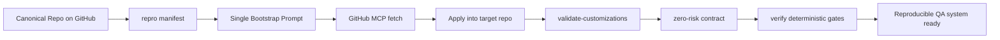
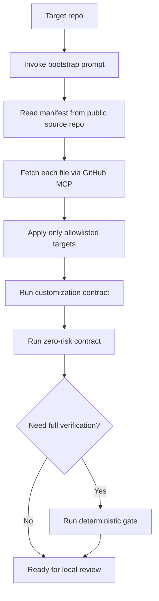
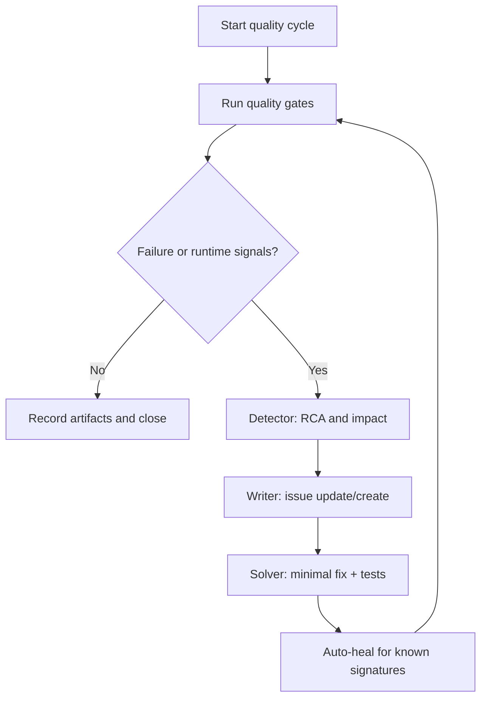

# GitHub MCP ベース再現ブートストラップ設計

このドキュメントは、品質保証システムの中核である「高精度問題・不具合検出」と「自動修復」を、別プロジェクトでも再現できるように抽象化した運用設計です。

## 目的

- 特定の 1 プロンプト実行で、エージェント/スキル/プロンプト群を再構築できる状態にする
- 参照元を GitHub 公開リポジトリに固定し、GitHub MCP 経由で読み取れるようにする
- 手順の属人化を防ぎ、差分の同期を反復可能にする
- `.github` の充実構成を外部リポジトリ参照だけで複製可能にする

## スコープ方針（full profile）

- 本設計では `profile=full` を標準とし、`.github` 配下の QA カスタマイズ資産を網羅する
- 対象は次の7群
  - Agents（coordinator/detector/writer/solver/router/deployer + MEMORY template）
  - Instructions（quality gates）
  - Prompts（autonomous orchestration + bootstrap prompt）
  - Skills（zero-risk/design/security/performance/wcag/validation/crud/test/combined audit）
  - Hooks（pre-tool/post-tool）
  - VS Code MCP config（`.vscode/mcp.json`）
  - Root policy file（`AGENTS.md`）
- これにより、参照先リポジトリ外でも同等の運用強度を再現できる

## 要点1: 高精度問題・不具合検出（MD箇条書き）

- 検出対象を「テスト失敗」だけに限定しない
- 実行時シグナルを同時に監視する
  - `console.error`
  - `pageerror`
  - `requestfailed`
  - `5xx` 応答
- API/DB/認可境界は、モックではなく実バックエンド接続の結合試験で検証する
- quick/full/deterministic の多段ゲートを持ち、最終完了条件を deterministic 通過に固定する
- `Mutation Testing / Property-Based Testing / Semantic Regression` を「定義だけでなく実行導線」に接続する
- traceability と監査アーティファクトをサイクル単位で保存し、検出漏れを構造的に減らす
- flaky チェックを品質信号として扱い、再現性の低い成功を完了扱いにしない

## 要点2: 自動修復（MD箇条書き）

- 自動修復は 2 層で設計する
  - ランタイム復旧層: 既知シグネチャに対する自動回復 (`guard:autoheal`)
  - 根本修正層: Detector -> Writer -> Solver の課題化・修復ループ
- ランタイム復旧層は「安全に機械実行できる処置」のみに限定する
  - 依存解決の再実行
  - Vite キャッシュ破棄
  - コンテナ再作成
- 修復後は必ず同一サイクルで再検証し、失敗 -> 修復 -> 再検証を閉ループ化する
- 修復の完了条件を「テスト成功 + 監査クローズ + 証跡整合」に設定する
- 残リスクは原則 `none` を必須とし、先送り完了を禁止する

## GitHub MCP 再現アーキテクチャ

## 外部参照再現フロー

## 検出から自動修復までの実行ループ

## 再現ブートストラップ手順

1. このリポジトリ（`flares-llc/agent-team-snapshots`）を参照元として利用する
2. 参照元に [docs/qa/repro-manifest.json](docs/qa/repro-manifest.json) を配置する
3. 取り込み先プロジェクトで `/rebuild-qa-ecosystem-from-github` を実行する
4. プロンプトが GitHub MCP で manifest と対象ファイルを取得して反映する
5. `npm run qa:customizations:validate` と `npm run qa:zero-risk:contract` を通す
6. 必要に応じて `npm run guard:verify:deterministic` まで実行する

## 汎用再構成時の推奨構成

- Agent
  - coordinator, detector, writer, solver, router, deployer, MEMORY-template
- Instruction
  - quality gate の fail-closed 契約
- Prompt
  - autonomous quality orchestration
  - bootstrap prompt (本ドキュメントで追加)
- Skill
  - zero-risk/design/security/performance/wcag/validation/combined-a11y-validation/crud/test-authoring
- Hook
  - pre-tool / post-tool ガード
- VS Code
  - `.vscode/mcp.json`（`github-mcp` などの接続定義）
- Contract
  - customizations validation
  - zero-risk contract
  - artifacts validation

## 運用上の注意

- リポジトリのルートを作業ルートとして扱い、コマンドはルート直下で実行する
- 参照元変更時は manifest の `version` を更新する
- 取り込み先への反映は「allowlist のみ」に限定し、アプリ実装コードへは触れない
- 反映後は差分レビューを行い、無関係な変更を混入させない
- `.github` の新規ファイル追加時は `docs/qa/repro-manifest.json` に同時追加し、full profile の欠落を防ぐ
